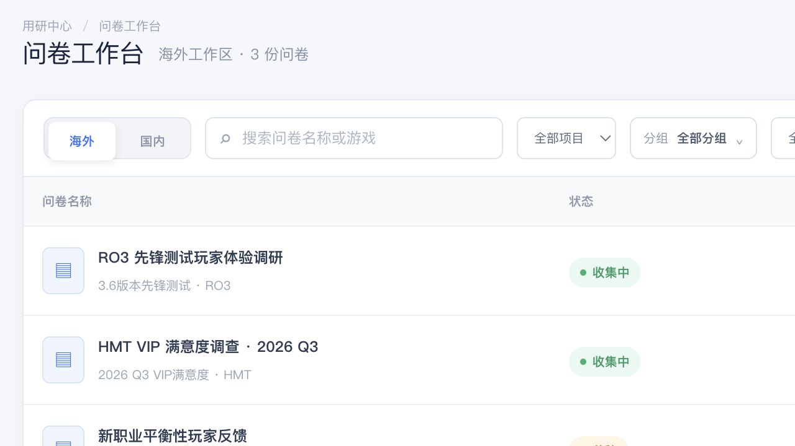

# JoyData Survey Workspace · 游戏用研问卷工作台

> 为游戏用户研究团队设计的问卷全生命周期工作台：从创建、投放，到回收、分析与归档。



普通表单工具能收集答案，却很难管理多个游戏、地区、版本和研究项目。JoyData 将“问卷”放回真实的用研流程中，让团队快速判断哪些项目正在收集、由谁负责、属于哪个游戏，以及后续应该如何分析。

[在线体验](https://joydata-survey-lottery.vercel.app/) · 已验证问卷工作台可访问

## 产品价值

- **面向游戏项目组织**：按 RO3、ROOC、HMT 等项目筛选，不再只依赖文件名。
- **兼顾国内与海外研究**：工作区支持区域切换，适配不同投放范围。
- **状态清晰**：收集中、草稿、已结束和回收站形成完整生命周期。
- **从搭建到分析闭环**：编辑器、预览、发布、答卷与分析页面相互衔接。

## 典型工作流

```text
选择模板 / 创建问卷
        ↓
编辑题目与逻辑 → 预览验证 → 发布收集
        ↓
查看答卷与数据分析 → 结束问卷 → 归档或回收
```

## 功能地图

| 场景 | 能力 |
| --- | --- |
| 工作台 | 搜索、项目/分组/创建人筛选、状态统计 |
| 模板中心 | 复用成熟研究框架，降低重复搭建成本 |
| 问卷编辑 | 配置题目、内容与问卷结构 |
| 发布与回收 | 管理收集状态和问卷生命周期 |
| 答卷管理 | 查看用户提交结果 |
| 数据分析 | 将回收结果转成可判断的研究信息 |
| 回收站 | 对误删或历史问卷进行统一管理 |

## 主要路由

| 路由 | 页面 |
| --- | --- |
| `/` | 问卷工作台 |
| `/templates` | 模板中心 |
| `/survey/[id]/edit` | 问卷编辑 |
| `/survey/[id]/preview` | 发布前预览 |
| `/survey/[id]/responses` | 答卷管理 |
| `/survey/[id]/analytics` | 数据分析 |
| `/trash` | 回收站 |

## 技术实现

- Next.js 16、React 19、TypeScript 5.9
- Tailwind CSS 4
- Drizzle ORM
- Vinext / Vite / Cloudflare 工具链

## 本地开发

要求 Node.js 22.13+。

```bash
npm ci
npm run dev
```

质量检查：

```bash
npm run lint
npm run build
```

## 当前原型状态与限制

仓库当前是可交互产品原型，演示数据用于还原团队工作流：工作台、模板、编辑、预览、答卷和分析页面可浏览，但不代表已经接入真实玩家数据或正式研究系统。

- **已验证**：公开工作台可访问，生产构建命令与主要路由已核对。
- **演示实现**：筛选、状态和页面流转以原型数据为主。
- **尚未接入**：正式身份认证、持久化数据库、问卷分发渠道、权限模型、导出与隐私合规策略。

## 后续方向

- 题目逻辑跳转、随机化和配额控制
- 多语言问卷与地区化配置
- 研究模板版本管理和团队协作审批
- 交叉分析、分群和数据导出
- 用户隐私、数据留存和删除策略
